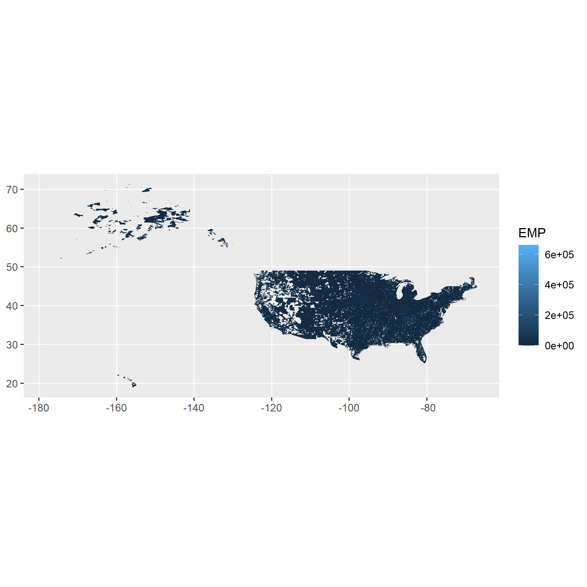

```{r,echo = F}
base_dir = getwd()
base_url = paste0("https://",substr(base_dir,8, nchar(base_dir)))
wp_link = paste0(base_url,"/WorkingPaper.html")
ws_link = paste0(base_url,"/WorkingSlides.html")
rep_link = paste0(base_url,"/Replication.html")
miniblog_link = paste0(base_url,"/MiniBlog.html")
```

[Home](https://chasewiedemann.github.io/index.html) |
[About](https://chasewiedemann.github.io/Site/about.html) |
[Projects](https://chasewiedemann.github.io/Site/Projects/projects.html) |
[Paper Summaries](https://chasewiedemann.github.io/Site/Summaries/summaries.html) |
[Blog](https://chasewiedemann.github.io/Site/blog.html) |

[Working Paper](`r wp_link`)|
[Working Slides](`r ws_link`)|
[Replication](`r rep_link`)|
[Mini-Blog](`r miniblog_link`)|

```{r}
library(dplyr)
library(censusapi)
knitr::opts_chunk$set(eval = F)
```

# Inital Post

Created the subdirectories along with a template. Want to make sure this will all work!

# Getting to work

I have the site running where I want, lets get to some actual work. What do I want to do to start the replication? There should obviously be some sort of explanation about what I am doing before I get into code. So maybe I get some back ground on the Alonso Muth and Mills cbd model, bring in some stuff about the polycentric theory, and then talk about static subcenter identification. I can then point out where I think the issues are with that, and introduce dynamics into the identification problem. 

Once thats all done, I think I want to try using the API. Thats probably not something I would have done if I wasnt doing this on the page, but isn't that the point of the page?

## Some Thoughts

The replication is getting pretty stream of consiousness as well. That was supposed to be reserved for the blog and mini-blog. But I think I am figuring out the difference. The Replicaiton can be editted, while the blogs cannot. So while I can go back and edit the absolute garbage that is in the replication page right now as I get a better idea of the direction of the project, I should be keeping the blog and mini-blogs as a constant stream. I also realized that I need to do more site editing. But Ill describe that in the big blog. 

## Were Back, and a Couple more Thoughts
This is very early stage, and this is the first mini-blog so bear with me. Similar to how I had header rules for the big blog, I'm gonna need some here as well. Maybe each day is a single hash, then topics are a double, and then thoughts about that topic are triples. Lets go with that

## Actual Work: Skipping to some data
I want to get some progress done. So we are gonna start getting the census api figured out to get the ZCBP stuff into our replication file. 

Ill update how that goes. Lets go.

### Jumping around
I through out some ideas about making my model based on the unobtainable Business Registrar in the Census, and how we need to do basically summary statistics from that because thats all we observe. Its a good idea but I feel like Im jumping around. Im gonna finish that thought and then get back to the data work.

### Style Question to Think about

When I working with code, I am already annotating with the text around it. What should my code comments be? Probably flags that I can easily reference in the text instead of typing out what I'm doing in a comment. Or maybe a mix of both. If i dont want to talk about it in the text, but it is somewhat noteworthy, Ill give it a comment, if can go without, it goes without, and if I want to talk about it in the text, Ill make some obvious flag and reference that flag in the text. Perfect. Lets go. to Lunch, but then were back

### Were Back

I just wrote something on the big blog about functions so that we dont have to run code every time. I also mentioned that I will be using binary files for some speed improvements (RDS). So lets see how that works here. I'm interested in how this is gonna look while I process through stuff. For example, Im gonna show how to do the basic api call first, and then write the function. 

Yikes. Do I even show that in the replicaiton? I should write the replication like Im doing it in real time, but when I go back and edit, will i be removing a bunch of stuff, and losing some detail. I guess yes. Thats the whole point of the mini-blog. Those kind of learning oportunities are documented here. A art form is gonna be finding the line between what goes in the mini blog and what gets editted out of the replication. But back to work. Lets go

### Almost back to work
Where do I want to load libraries? I think it should be at the top. But when I call a function from a library I should be mentioning what its dependency is. Also that keeps normal formatting throughout, instead of placing it before the first code block. Lets go

### yikes

I have not even considered working directories yet. I went to call something, and I immediately got an error. Im gonna explore this a bit and then report back.

### Change

Ok. I have been working and it seems like I'm doing the blog in the replicaiton way to much. But I think this part is important to archive. So Im actually gonna work in here a bit more, and then export over to the replication once I am done.

## Working in the Mini Blog

### Historical Note
I hd been working on this is the replication file, and want to port it over, so its a bunch of text now.

### What I did before

We are going to be using the County Business Patterns Zipcode Files for this project. These are basically a summary statistic of the Business Registar at the zipcode level. The Business Registar has the data on every business that is registered with the IRS. So its about as good as your are gonna get. Our model is in terms of that, and our econometric strategy requires additional assumptions to use the zipcode level. But enough about things that are eventually gonna be moved out of this section and onto the data.

We are gonna be using the census api to get this done. The website that its hosted at is 

https://www.census.gov/data/developers/data-sets/cbp-zbp/cbp-api.html

Were gonna try using the `censusapi` R package. I'm following a tutorial I found that can be accessed at

https://www.hrecht.com/censusapi/articles/getting-started.html

I first need to get a key. That is done through the following link

https://api.census.gov/data/key_signup.html

I got a key, it came in an email. Below is a non-echoed R chunk that assigns my key to the variable `MY_CENSUS_KEY` and then I have `Sys.setenv(CENSUS_KEY=MY_CENSUS_KEY)`

```{r,echo = F}
MY_CENSUS_KEY = "c161ed0f016172a3598940df9853fe128705043e"
Sys.setenv(CENSUS_KEY=MY_CENSUS_KEY)
```

I wouldn't really mind if you use my key. But Ill keep it private. But back to work. Heres code taken from the tutorial just to make sure it works on my end


```{r}
sahie_counties <- getCensus(
    name = "timeseries/healthins/sahie",
    vars = c("NAME", "PCTUI_PT", "NUI_PT"), 
    region = "county:*", 
    time = 2021)
head(sahie_counties)
```

### Start Realtime

Ok now that we have that figured out. Lets get the zipcode level county business patterns. Theres 1621 rows, so Ill only do a head()

```{r}
apis = listCensusApis()
head(apis)
colnames(apis)
```
But we need to find the county business pattern stuff. THe CBF Website is here

https://www.census.gov/data/developers/data-sets/cbp-zbp/cbp-api.html

Looking at the json files [here](https://api.census.gov/data/2022/cbp), we see that the title variable is "2022 County Business Patterns". After some exploring (looking at all the titles) I found

```{r}
apis[1000,]
```

This tells us that we just need the filter by `name == "zbp"`

```{r}
zbp = apis %>%
  filter(name == "zbp")
```

### Side Note

I decided that its probably not a good idea to have this evaluate within the blog. When I'm working, Ill have eval = T, but when its up I'm gonna turn eval = F. So you wont see the output, and Ill try to keep that in mind while Im writing. The replication will obvious have the evals, but it wont ahve all this minor stuff. But you can probably download the page, and turn evals = T at the top if you'd like to see some of the nitty -gritty.

### Back to regularly scheduled programming

Heres the names of all we get

```{r}
zbp$title
```
I know that it starts in 1994, but where is 2019-2024

Lets look at a table of api names

```{r}
table(apis$name)
```
Maybe its lumped into cbp. lets look at that and filter by year

```{r}
cbp = apis %>%
  filter(name == "cbp", vintage %in% 2019:2024)
cbp$title
```

I think thats it. We only get to 2022, but that fine for now. Lets create a list of all the apis we want to use

```{r}
zip_apis = apis %>%
  filter(name %in% c("zbp","cbp"), vintage %in% 1994:2022)
zip_apis
```

### New Route

the census pretty much gives us this for free on a webpage. Then I dont need to worry about dependencies. Its worth trying.

```{r}
library(rvest)
tt = read_html("https://api.census.gov/data/2018/zbp?get=ESTAB,EMPSZES&for=zipcode:20002&NAICS2017=72") %>% html_text()
strsplit(tt,"\n")
```
Honestly beautiful. Lets breakdown what that call is doing. Lets call the preamble "https://api.census.gov/data/". The Next part is the year. and then we have "zbp?get=". I want everything. So Im pretty sure I can just wildcard after that. Lets try for 2018

```{r,eval = F}
tt = read_html("https://api.census.gov/data/2018/zbp?") %>% html_text()
strsplit(tt,"\n")
```
No dice, but it does give me the json. And in that json theres

http://api.census.gov/data/2018/zbp/variables.json

There are so many NASICs codes. My personal favorite (of the ones I skimmed) is  "51119100": "Greeting card publishers".

Heres something useful

https://www.census.gov/content/dam/Census/data/developers/api-user-guide/api-user-guide.pdf

And 

https://api.census.gov/data/2018/zbp/variables.html

I got it working through trial and error, but it takes a while to load. But more importantly, we need a time series from 1994. So what was available back then is going to dictate what we can use now. Lets see what variables they had back then.

```{r,eval =F}
url = "https://api.census.gov/data/2018/zbp?get=EMP,EMP_N,EMPSZES,ESTAB,GEO_ID,GEOCOMP,INDGROUP,INDLEVEL,NAICS2017&for=zipcode:63112"
tt = read_html(url) %>% html_text()
strsplit(tt,"\n")
```
Heres the website for 1994 variables

https://api.census.gov/data/1994/zbp/variables.html

I'm looking at the other years now and it seems like this might be a larger issue. Lets commit and then get back to it.

## Back

Ok. I got my commit back in and were ready to work. Lets loop through the variables for each year. It turns out that the zbp gets absorbed into the cbp in 2019, explaining the issue from before. lets get working with the 1994:2018 data, and we can always come back and get those last years (if we even want them. Covid ruined data)

```{r,eval = F}
years = 1994:2018
names = matrix(nrow = length(years),ncol = 2)
for (i in 1:length(years)) {
 url = paste0("https://api.census.gov/data/",years[i],"/zbp/variables.html")
 tt = read_html(url) %>% html_table() %>% data.frame()
 names[i,1] = years[i]
 names[i,2] = paste0(tt$Name,collapse = ",")
  
 }

```
Looking at it, 1994 and 2018 have the following variables in common
- EMP,EMPSZES,ESTAB,GEO_ID,PAYANN, ZIP

There theres the SIC codes 
1994:1997 - SIC
1998:2002 - NAICS1997
2003:2007 - NAICS2002
2008:2011 - NAICS2007
2012:2016 - NAICS2012
2017:2018 - NAICS2017

Lets write some code that extracts just this stuff

```{r.eval =F}
years = 1994:2018
data = c()
for (i in 1:length(years)) {
cur_year = years[i]
if (cur_year %in% 1994:1997) {
  cur_sic = "SIC"
} else if (cur_year %in% 1998:2002) {
  cur_sic = "NAICS1997"
} else if (cur_year %in% 2003:2007){
  cur_sic = "NAICS2002"
} else if (cur_year %in% 2008:2011){
  cur_sic = "NAICS2007"
} else if (cur_year %in% 2012:2016){
  cur_sic = "NAICS2012"
} else {
  cur_sic = "NAICS2017"
}

url = paste0("https://api.census.gov/data/",cur_year,"/zbp?get=EMP,EMPSZES,ESTAB,GEO_ID,PAYANN,ZIPCODE,",cur_sic,"&for=zipcode:63112")
tt = read_html(url) %>% html_text() %>% strsplit(.,"\n") %>% unlist()
data = c(data,tt)

}
getwd()
saveRDS(data,file = "Data/zbf1994_2018.rds")

```

Notice I saved to .rds. Lets see what that looks like on the other end

```{r,eval = F}
tt = readRDS("Data/zbf1994_2018.rds")
```

This seems like a good time to move all this over and clean it up in the Replication file.

## Replication File

I have the Data section in the replication page up to the same point here. But I am actually running the whole years and zipcodes files and it is taking forever. I need to make sure to keep this file somewhere safe. 

## Skipping steps

Ok. I want to get this ready for the reading group. Im gonna go back and edit the intro a bit, and then start with replicating McMillen 2001 with the zbp 1994 data.

## A good Idea
I realized I want to change the name of my data, but is that really neccessary? Probably something I can do before I leave. I should make a list of that in the main blog.

## Slacking

I have been slacking on the mini blog and that is not because their hasnt been anything to say. I turned my back on the code and it decided to no longer work. Always great. Lets get it back working in here. Here it is currently. 

```{r}
clean_zbp = function(){
for (i in 1:length(years)) {
  file_location = paste0("Data/Scrape/zbp_scrape",years[i],".rds")
  tt = readRDS(file_location)
  var_names = tt[1] %>% strsplit(",") %>% unlist() %>% gsub("[^a-zA-Z]", "", .)
  data = tt[-1]
  data = data %>% strsplit(",") %>% unlist() %>% gsub("null",NA,.) %>% gsub('"','', .) %>% gsub("\\]","",.) %>% matrix(ncol = 8) 
  colnames(data) = var_names
  filename = paste0("Data/Cleaned/zbp_clean",years[i],".rds")
  saveRDS(data,filename)
}
}
```

There is a years variable floating around in the enviroment that is set to `1994:1994`. I have it that way so I can just run the 1994 stuff instead of everything to get it through, but I wont't have to go back and rewrite it for all years. Lets load in the file and see if its all good.

```{r}
i = 1
years = 1994:1994
file_location = paste0("Data/Scrape/zbp_scrape",years[i],".rds")
tt = readRDS(file_location)
head(tt)
### That looks all good, lets try the next steps
var_names = tt[1] %>% strsplit(",") %>% unlist() %>% gsub("[^a-zA-Z]", "", .)
data = tt[-1]
#  data = data %>% strsplit(",") %>% unlist() %>% gsub("null",NA,.) %>% gsub('"','', .) %>% gsub("\\]","",.) %>% matrix(ncol = 8) 
### Im gonna remove the matrix call
#data[1:3] %>% strsplit(",") %>% unlist() %>% gsub("null",NA,.) %>% gsub('"','', .) %>% gsub("\\]","",.) ## this works like it should, just is a vector
## Going to try it with a matrix again, and a byrow
## data[1:3] %>% strsplit(",") %>% unlist() %>% gsub("null",NA,.) %>% gsub('"','', .) %>% gsub("\\]","",.) %>% matrix(ncol =8,byrow = T) ## This works!
## A little longer
#data[10:20] %>% strsplit(",") %>% unlist() %>% gsub("null",NA,.) %>% gsub('"','', .) %>% gsub("\\]","",.) %>% matrix(ncol =8,byrow = T) ## This works!
## Ok I think its good
```  

Now that I can look at the data better, thats a absolute ton of SIC codes. I can't imagine I need all of those. Lets table them

```{r,eval = F}
tt = readRDS("C:/Git/chasewiedemann.github.io/Site/Projects/MuniProject/Data/Cleaned/zbp_clean1994.rds")
table(tt[,7])
```

Gross. This link is helpful

https://www.census.gov/programs-surveys/economic-census/year/2022/guidance/understanding-naics.html#par_textimage_0

I can probably get away with just the two digit code (sector) and totals. That will probably speed up my scrape by an order of magnitude as well. Lets try that here. I was a little worried about giving out my zipcode for a second, but its also WashU's zipcode, so really what could happen?

```{r,eval = F}
cur_year = 2018
cur_sic = "NAICS2017"
sector_sics = "00,11,21,22,23,31,32,33,42,44,45,48,49,51,52,53,54,55,56,61,62,71,72,81"
url = paste0("https://api.census.gov/data/",cur_year,"/zbp?get=EMP,EMPSZES,ESTAB,GEO_ID,PAYANN,",cur_sic,"&for=zipcode:90210&for=",cur_sic,":",sector_sics)
tt = read_html(url) %>% html_text() %>% strsplit(.,"\n") %>% unlist()
tt

```
## A decision to make
It would be a lot easier just to download from their website. I'll admit, not as cool. Yeah definitely not as cool, and I like the scrapy-ness of this method. 

## Back to it
I can just append a "$SIC=" then the list of SICS. 

## Screw it.
I can just get it all and then clean. Speed of my scraping is not really an issue. This is becoming more of a tangent than actually helping me. 

## This needs a deep clean
I shouldnt be opening closing and opening and closing all these files. They should all be done at the same time. Or at least each year should be done. Let me look at how difficult that would be,

### A middle ground. 
I should probably keep the scrape seperate, but I can merge clean and append portions. Lets do that in here

Heres the clean

```{r}
clean_zbp = function(){
for (i in 1:length(years)) {
  file_location = paste0("Data/Scrape/zbp_scrape",years[i],".rds")
  tt = readRDS(file_location)
  var_names = tt[1] %>% strsplit(",") %>% unlist() %>% gsub("[^a-zA-Z]", "", .)
  data = tt[-1]
  data = data %>% strsplit(",") %>% unlist() %>% gsub("null",NA,.) %>% gsub('"','', .) %>% gsub("\\]","",.)  %>% gsub("\\[","",.) %>% matrix(ncol =8,byrow = T)
  colnames(data) = var_names
  filename = paste0("Data/Cleaned/zbp_clean",years[i],".rds")
  saveRDS(data,filename)
}
}
```

And heres the append 

```{r}
append_area_zbp = function(){
for (i in 1:length(years)) {
file_location = paste0("Data/Cleaned/zbp_clean",years[i],".rds")
tt = readRDS(file_location) %>% data.frame()
tt$zipcode = as.numeric(tt$zipcode)
cross = read.csv("Data/zip_area_crosswalk.csv") %>%
  select(zcta19, zcta_area, year_intp,intp_flag,prop_value_21,prop_value_22,prop_value_23,prop_value_24) 
tt = merge(tt,cross,all.x = T, by.x = "zipcode", by.y = "zcta19")
 filename = paste0("Data/Appended/zbp_appended",years[i],".rds")
  saveRDS(tt,filename)
}
}
```

And heres were Ill put them togther
 
```{r}
clean_zbp = function(){
### Read Cross In at the Top
cross = read.csv("Data/zip_area_crosswalk.csv") %>%
  select(zcta19, zcta_area, year_intp,intp_flag,prop_value_21,prop_value_22,prop_value_23,prop_value_24) %>%
  filter(year_intp == 2006)

for (i in 1:length(years)) {
  file_location = paste0("Data/Scrape/zbp_scrape",years[i],".rds")
  tt = readRDS(file_location)
  var_names = tt[1] %>% strsplit(",") %>% unlist() %>% gsub("[^a-zA-Z]", "", .)
  data = tt[-1]
  data = data %>% strsplit(",") %>% unlist() %>%
          gsub("null",NA,.) %>% gsub('"','', .) %>% gsub("\\]","",.)  %>% gsub("\\[","",.) %>%
          matrix(ncol =8,byrow = T) %>% data.frame()
  
  colnames(data) = var_names
  data$zipcode = as.numeric(data$zipcode)
  
  filename = paste0("Data/Cleaned/zbp",years[i],".rds")
  saveRDS(merge(data,cross,all.x = T, by.x = c("zipcode", by.y = "zcta19"),filename))
  }
}
```

## Census API
Well thats stupid. If I just append a space to the end of my api call ( like "SIC=00 " instead of "SIC=00") it will only pick up the 00 sics. Thats convinient, but also incredibly stupid

With that I have to re-clean the data

```{r}
i = 1
years = 1994:1994
file_location = paste0("Data/Scrape/zbp_scrape",years[i],".rds")
tt = readRDS(file_location)
#head(tt)
### That looks all good, lets try the next steps
var_names = tt[1] %>% strsplit(",") %>% unlist() %>% gsub("[^a-zA-Z]", "", .)
data = tt[-1]
#  data = data %>% strsplit(",") %>% unlist() %>% gsub("null",NA,.) %>% gsub('"','', .) %>% gsub("\\]","",.) %>% matrix(ncol = 8) 
### Im gonna remove the matrix call
#data[1:3] %>% strsplit(",") %>% unlist() %>% gsub("null",NA,.) %>% gsub('"','', .) %>% gsub("\\]","",.) ## this works like it should, just is a vector
## Going to try it with a matrix again, and a byrow
## data[1:3] %>% strsplit(",") %>% unlist() %>% gsub("null",NA,.) %>% gsub('"','', .) %>% gsub("\\]","",.) %>% matrix(ncol =8,byrow = T) ## This works!
## A little longer
#var_names
#data[10:20] %>% strsplit(",") %>% unlist() %>% gsub("null",NA,.) %>% gsub('"','', .) %>% gsub("\\]","",.) %>% matrix(ncol =7,byrow = T) ## This works!
## Ok I think its good
```

I jsut need to change it from an 8 to a 7 in the matrix call.

but the clean is getting mad for some reason
```{r}
cross = read.csv("Data/zip_area_crosswalk.csv") %>%
  select(zcta19, zcta_area, year_intp,intp_flag,prop_value_21,prop_value_22,prop_value_23,prop_value_24) %>%
  filter(year_intp == 2006)
cross$zcta_area = cross$zcta_area/1000 #convert to km

  file_location = paste0("Data/Scrape/zbp_scrape",years[i],".rds")
  tt = readRDS(file_location)
  var_names = tt[1] %>% strsplit(",") %>% unlist() %>% gsub("[^a-zA-Z]", "", .)
  data = tt[-1]
  data = data %>% strsplit(",") %>% unlist() %>%
          gsub("null",NA,.) %>% gsub('"','', .) %>% gsub("\\]","",.)  %>% gsub("\\[","",.) %>%
          matrix(ncol =7,byrow = T) %>% data.frame()
  
  colnames(data) = var_names
  data$zipcode = as.numeric(data$zipcode)
  
  filename = paste0("Data/Cleaned/zbp",years[i],".rds")
#out= merge(data,cross,all.x = T, by.x = "zipcode", by.y = "zcta19"),filename
  
```

## Where the mini blog shines

This was originally in the replication, but I want to move it here, and then just have a note to look in here to find what the seemingly aribtrary chagnes to the code do.

An issue we see right away is that  of our Zipcodes that were in the Census are not in tigris. What is going on here? Lets get some summary statistics about our missing data

```{r}
missing = tt[is.na(tt$ALAND00),]
summary(missing[,c("zipcode","EMP","ESTAB","PAYANN")])

```

We are missing 8411, we can immediately get rid of a quick data quirk 

```{r}
summary(missing[,c("zipcode","EMP","ESTAB","PAYANN")])
missing[which.max(missing$EMP),]
```
this is is well documented. Some firms will just put this as their zipcode if they dont have a physical location. Lets look at the top 5 largest missing values

```{r}
missing = missing[missing$zipcode != "99999",]
```
I found a Stanford project that has a cross walk. the link is [here](https://redivis.com/StanfordPHS). I have put the crosswalk in the data folder as `zip_latlong_crosswalk.csv`. I prefer using the tigris definitions, but will default to these for missing values. We also need a area crosswalk, that is taken from [here](https://www.openicpsr.org/openicpsr/project/128862/version/V1/view) and is stored as `zip_area_crosswalk.csv`

```{r}

latlong_cross = read.csv("Data/zip_latlong_crosswalk.csv")
latlong_cross$Zip[nchar(latlong_cross$Zip) != 5] =paste0("0",latlong_cross$Zip[nchar(latlong_cross$Zip) != 5])
latlong_cross$Zip[nchar(latlong_cross$Zip) != 5] =paste0("0",latlong_cross$Zip[nchar(latlong_cross$Zip) != 5])
area_cross = read.csv("Data/zip_area_crosswalk.csv") %>% filter(year_intp == 2001)
area_cross$zcta19[nchar(area_cross$zcta19) != 5] =paste0("0",area_cross$zcta19[nchar(area_cross$zcta19) != 5])
area_cross$zcta19[nchar(area_cross$zcta19) != 5] =paste0("0",area_cross$zcta19[nchar(area_cross$zcta19) != 5])

missing = merge(missing,latlong_cross,all.x = T, by.x = "zipcode", by.y ="Zip")
missing = merge(missing,area_cross,all.x = T, by.x = "zipcode", by.y = "zcta19")

missing_one = missing[is.na(missing$geopoint) |is.na(missing$zcta_area),]
summary(missing_one[,c("zipcode","EMP","ESTAB","PAYANN")])
```

Okay, so 7055 are missing both area and lat and long. But we can check two thing. First, we only need area to get employment density. if employment is 0, it doesnt matter the size.

```{r}
missing_one =  missing_one[missing_one$EMP != 0,]
summary(missing_one[,c("zipcode","EMP","ESTAB","PAYANN")])
```
So we only really have an issue with 4837. So we need to impute these guys. But do we have their location?

```{r}
missing_both = missing_one[is.na(missing_one$geopoint),]
summary(missing_both[,c("zipcode","EMP","ESTAB","PAYANN")])
```
So we only have 146 that are missing both location and area. 

What about the ones that we are missing only area. Where are they?

```{r}
missing_have_loc = missing[!is.na(missing$Longitude) & missing$EMP != 0,]
library(sf)
library(ggplot2)

my_sf <- st_as_sf(missing_have_loc, coords = c('Longitude', 'Latitude'))


#Plot it:

ggplot(my_sf) + 
  geom_sf(aes(color = EMP))
```
So they seem pretty spread out. What happens when I just plot all of the zipcodes we have, are we going to see 8410 holes?

```{r,eval = F}
# gg = ggplot(data = tt) + 
#   geom_sf(color = NA, aes(geometry = geometry, fill = EMP))
# gg
# ggsave("allDataPlot.png")

```
So this is a bad idea. The ggplot object is over 1.1 GB. Woops.

But this is the output



## Another data set

heres the link

https://hub.arcgis.com/datasets/esri::usa-zip-code-boundaries/about

It the areas

https://www.tomtom.com/

Also Lets start a new chunk with everythign so far

```{r,eval = F}
library(dplyr)
tt = readRDS("Data/ZBP/zbp2000.rds")
zip2000 = readRDS("Data/zip2000.rds")
## Merge with tigris
tt = merge(tt,zip2000,all.x = T, by.x = "zipcode", by.y = "ZCTA5CE00")
rm(zip2000)
latlong_cross = read.csv("Data/zip_latlong_crosswalk.csv")
latlong_cross$Zip[nchar(latlong_cross$Zip) != 5] =paste0("0",latlong_cross$Zip[nchar(latlong_cross$Zip) != 5])
latlong_cross$Zip[nchar(latlong_cross$Zip) != 5] =paste0("0",latlong_cross$Zip[nchar(latlong_cross$Zip) != 5])
area_cross = read.csv("Data/zip_area_crosswalk.csv") %>% filter(year_intp == 2001)
area_cross$zcta19[nchar(area_cross$zcta19) != 5] =paste0("0",area_cross$zcta19[nchar(area_cross$zcta19) != 5])
area_cross$zcta19[nchar(area_cross$zcta19) != 5] =paste0("0",area_cross$zcta19[nchar(area_cross$zcta19) != 5])

tt = merge(tt,latlong_cross,all.x = T, by.x = "zipcode", by.y ="Zip")
tt = merge(tt,area_cross,all.x = T, by.x = "zipcode", by.y = "zcta19")

tt = tt[!(tt$zipcode %in% c("99999","00501")),]
```

```{r,eval = F}
area_cross2 = read.csv("Data/USA_ZIP_CODE_Boundaries.csv")
area_cross2$ZIP_CODE[nchar(area_cross2$ZIP_CODE) != 5] =paste0("0",area_cross2$ZIP_CODE[nchar(area_cross2$ZIP_CODE) != 5])
area_cross2$ZIP_CODE[nchar(area_cross2$ZIP_CODE) != 5] =paste0("0",area_cross2$ZIP_CODE[nchar(area_cross2$ZIP_CODE) != 5])
area_cross2$ZIP_CODE[nchar(area_cross2$ZIP_CODE) != 5] =paste0("0",area_cross2$ZIP_CODE[nchar(area_cross2$ZIP_CODE) != 5])
area_cross2$ZIP_CODE[nchar(area_cross2$ZIP_CODE) != 5] =paste0("0",area_cross2$ZIP_CODE[nchar(area_cross2$ZIP_CODE) != 5])
tt = merge(tt,area_cross2,all.x = T, by.x = "zipcode",by.y = "ZIP_CODE")

tt = tt %>% select(zipcode,City, State,EMP,ESTAB,PAYANN,year,INTPTLAT00,INTPTLON00,Latitude,Longitude,ALAND00,AWATER00,zcta_area,Shape__Area)
```

## Okay. 

We now have all the data by year, merged in with everythign else. Let collapse this to a single file and then get rid of all the extra stuff to free up some space on my hard drive

```{r}
library(dplyr)
clean_zbp_full = function(){
for (i in 1:length(years)) {
  print(years[i])
file_location = paste0("Data/ZBP_FULL/full_zbp",years[i],".rds")
tt = readRDS(file_location) %>%
    select(zip,EMP,ESTAB,PAYANN,year,Shape__Area,ALAND00,AWATER00,zcta_area,Latitude,Longitude,INTPTLAT00,INTPTLON00,geometry) %>%
    mutate(area = ifelse(!is.na(ALAND00),ALAND00,ifelse(!is.na(zcta_area),zcta_area,Shape__Area)),
           lat = ifelse(!is.na(INTPTLAT00),INTPTLAT00,Latitude),
           lon = ifelse(!is.na(INTPTLON00),INTPTLON00,Longitude)) %>%
  select(zip,year,EMP,ESTAB,PAYANN,lat,lon,geometry)
tt$lat = as.numeric(tt$lat)
tt$lon = as.numeric(tt$lon)
filename = paste0("Data/ZBP/ZBP",years[i],".rds")
saveRDS(tt,filename)
}
}
```

